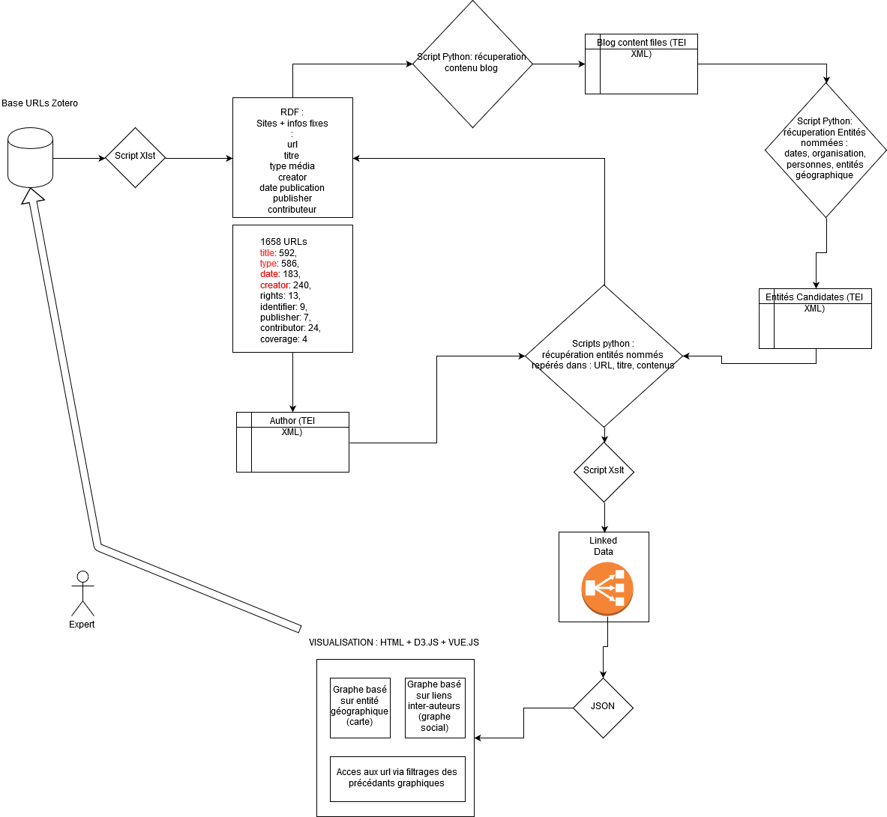

# NOTES réunions 
## 07/10/2019 - présents : Anaïs, Célian et Inès ; Cote, Velcin, Fewou Ngouloure 

* Attente du crawl
* URL : peut contenir nom personnes/localisation/type de média

La question des réseaux sociaux : facebook/twitter/mondoblog  
-> textes courts

Identifier les temporalités : date de mise à jours page

Description à travers ces littéralités de styles de vie, promotion, de la vie sociale de ces auteurs

> Deja faire avec ce que l'on a  
  
## Comment ces données ont-elles été récupérées  ?  
* A travers la base de données de la BNF : les auteurs ayant publié au moins un livre. 
* A travers l'exploration des liens
* De manière intuitive
* A travers la recherche sur Google de mots clefs contextuels, ex : "NOM Prenom PAYS"  

## Comment créer les liens ?  
PAS SEULEMENT SUR LA BASE DES "AMIS DECLARES" :
* exploration de commentaire
* évocation des auteurs dans interviews
"Le problème avec Facebook c'est que certains auteurs sont amis avec d'autres juste pour suivre une sorte d'actualités lié à son activité" -> veille auprès "d'influenceurs"
> Ce qui est important ce sont aussi les relations sociale réciproques

## Mais les liens se limites à des relations amis-amis ?  
PAS SEULEMENT : on peux parler de liens si ils sont dans les même pays, régions, qu'il utilisent les même médias.

## Coté format :
* PRISM : il est utilisé par Google News par example pour structurer des données de presses.
* IPTC : sympa mais privé...
* FOAF : surtout pour la représentation de relations sociales

> Utilisation de Zotéro pour gérer la collection ? __a discuter__

# REFLEXIONS A PART :
- on essaie de découvrir des auteurs qui ne seraient pas référencés par la BNF
- Qui cite qui -> travail de Mathilde Forestier
- Le problème de la géolocalisation : exemple MondoBlog
- Les lieux évoqués / les lieux de vies
- L'importances de la longueur des contenus (blog = long, réseaux sociaux = court)
- On intérroge la notion d'auteurs ? Qu'est-ce qu'un auteur aujourd'hui ?

## 22/10/2019 - présents : Anaïs et Inès ; Velcin et Cote

### Le corpus de BASE
Mise au point avec le corpus Zotero qui était mal référencé et qui ne permettait pas un traitement intéressant des données:
* M. Cote décide de référencer un maximum la bibliothèque Zotero telle qu'elle aurait du être faite auparavant
* Il décide de se focaliser sur les données littéraires des auteurs du web littéraire de la zone caraïbe et plus particulièrement Haïti

Ainsi on repart sur un autre corpus d'une centaine d'auteurs d'un _échantillon test **limité et représentatif**_

### Le schéma
  
* Importation de la bibliothèque Zotéro (annotée grâce à BIBO) en fichier RDF avec des _métadonnées complètes_ afin d'être exploiter au maximum et créer des liens
* Du RDF on extrait:
  * le contenu du blog = en XML
    * auquel on extrait des **entités nommées** = en XML
    * Problème des mots clefs qui permettent d'exploiter uniquement l'EXPLICITE. On perd donc tous les éléments IMPLICITE. Ce travail **ne peut pas s'automatiser, la main humaine est INDISPENSABLE**
  * des **fiches d'auteurs véritables** = en XML
* À l'aide des fiches d'auteurs et des entitées nommées  on remonte jusqu'au fichier RDF pour faire les liens entre auteurs/contenus pour créer **_un fichier unique_** **!! ZONE DE FLOU !!**
* exploitation du fichier avec JSON avec lequel on créera une page web contenant des visualisations.

### les logiciels utilisés
* Beautiful Soup : pour enlever les tags sur les pages
* Newspaper : pour l'extraction du contenu des blogs
* Spacy : étiquetage morphosyntaxique
* Lefff : une surcouche de Spacy adapté au français

### Les sites de communautés-auteurs qui servent de points relais
Des groupes d'auteurs critiques qui vont se retrouver lors d'**évènements**. Il faut donc trouver un moyen de _contextualiser les évènements_ : à l'aide de mots contextuels : nom de l'événement, date, lieu, etc.

### Finalement plusieurs corpus...
* l'ensemble des URL
* un corpus des *sites points-relais* qui permettent de faire les liens entres auteurs
* le contenu des pages : *la production littéraire en elle-même*
* les fiches auteurs
* la liste des événements

### Des prolongements annexes au projet
#### But 2
Proposé par **Velcin** : _Trouver un moyen d'**automatiser le processus d'annotation_enrichissement** de la bibliothèsque Zotero_ OU _Comment enrichir le RDF de métadonnées **automatiquement**_.

Un questionnement commun dans l'équipe : **Jusqu'où arrêter l'automatisation?**. Lorsque l'ambition lié à la performance oublie le cerveau humain qui est INDISPENSABLE dans la recherche. Questionner les limites de la machine qui agit mais qui ne réfléchi pas. 
* Nécessité d'écrire une partie sur ses points
* Proposer une solution pour **faciliter et non automatiser** le travail du chercheur à l'aide d'abonnement à des **FLUX CSS** des communautés d'auteurs.
  * Chercher s'il en existe
  * Référencer les sites qui propose des flux css et ceux qui n'en propose pas

#### But 3
_Comment exploiter les données autour de facebook._

#### But 4
Suite à une dicussion avec M. Cote : _Suivre le processus d'accomplissement d'un auteur du web jusqu'à la publication_

Réfléchir à un (troisième) corpus qui serait un fichier XML d'auteurs publiés. Ce fichier pourrait être obtenu à l'aide des fiches d'autorités d'auteurs que possède la BNF.

### Le rendu de mi-novembre
Un rendu rédigé qui doit être donné le **14 novembre**
Une réunion après le rendu le **lundi 18 novembre 12H-13h15** dans _la salle Georges Lyvet de la MSH de Lyon_ (salle réservée à partir de 11H pour pouvoir s'entraîner). Une présentation avec des slides. 

Faire **une proposition socle** avec des étapes variantes.
* Construction d'un réseau socle avec analyse des réseau auteurs en vue de proposer des visualisations *dynamiques*
* TOUT mentionner
  * 1er problème : la question de la **représentativité**
  * 2ème problème : quand arrêter l'**automatisation**
  * 3ème problème : un projet qui fait l'impasse de **mots clefs de l'implicite**
 
 NE PAS OUBLIER LES CITATIONS D'ANAÏS ET DE CÉLIAN DANS LA RÉDACTION
 
 

